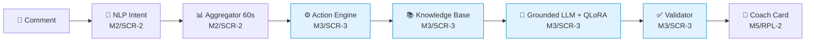

[README.md](https://github.com/user-attachments/files/31262756/README.md)
# M3-SCR-3<div align="center">

# 🎯 LiveCoach AI — M3/SCR-3
### LLM · Knowledge · Policy

*Komponen otak keputusan & bahasa dari LiveCoach AI — asisten AI untuk host live commerce*


**Babak Penyisihan · AIC COMPFEST 18**

</div>

---

## 📋 Daftar Isi

1. [Ringkasan](#-ringkasan)
2. [Dokumen Acuan](#-dokumen-acuan)
3. [Arsitektur & Alur Pipeline](#️-arsitektur--alur-pipeline)
4. [Struktur Folder](#-struktur-folder)
5. [Status Enum Resmi](#-status-enum-resmi)
6. [Cara Menjalankan](#-cara-menjalankan)
7. [Koordinasi Antar Peran](#-koordinasi-antar-peran)
8. [Yang Sengaja Belum Dikerjakan](#️-yang-sengaja-belum-dikerjakan)
9. [Urutan Baca untuk Kontributor Baru](#-urutan-baca-untuk-kontributor-baru)
10. [Riwayat Perubahan](#-riwayat-perubahan)

---

## 📌 Ringkasan

Folder ini berisi seluruh deliverable milik **M3/SCR-3**, sesuai pembagian peran tim:

> *"Knowledge base, response dataset, QLoRA, validator, action rules"* — di-review silang oleh **M2/SCR-2**, dependency-nya diintegrasikan oleh **M4/RPL-1** (backend).

| | |
|---|---|
| 🧩 **Komponen** | Action Engine, Knowledge Base, Response Dataset, LLM + QLoRA, Validator |
| 🔗 **Reviewer silang** | M2/SCR-2 |
| 🏗️ **Diintegrasikan oleh** | M4/RPL-1 (backend) |
| 📅 **Update terakhir** | 19 Agustus 2026 |

### Angka cepat

| Metrik | Nilai |
|---|---|
| Total fact di Knowledge Base | 61 (60 publik + 1 referensi internal) |
| Fact type resmi ter-cover | 6 dari 7 (`CHECKOUT_GUIDE` belum ada fact) |
| Pasang `audience_state`→`selected_action` aktif | 4 dari 8 |
| Contoh dataset training | 60 baris, tersebar rata 15/action |
| Hasil validasi dataset terbaru | ✅ **60/60 PASSED (100%)** |
| Training QLoRA sudah dijalankan? | ❌ Belum (butuh GPU, wajib di Google Colab) |

> ⚠️ Repo ini baru saja melalui **review menyeluruh (19 Agustus 2026)**. Versi sebelumnya memakai taxonomy `audience_state`/`selected_action` buatan sendiri yang **tidak cocok** dengan enum resmi dokumen (Section 4.2 & 11). Semua file sudah ditulis ulang agar selaras — kronologi lengkapnya ada di [`DECISIONS_LOG.md`](./DECISIONS_LOG.md).

---

## 📖 Dokumen Acuan

Acuan tunggal (*single source of truth*) untuk semua keputusan di repo ini:

> **`LiveCoach_AI_Spesifikasi_Web_Penyisihan.docx`** (v1.0, 5 Agustus 2026)

**Aturan emas:** kalau ada bagian repo ini yang kelihatan berbeda dari dokumen tersebut, **dokumen yang menang**, bukan repo ini — kecuali perubahan itu sudah disepakati bersama tim dan `schema_version` terkait sudah dinaikkan.

---

## 🗺️ Arsitektur & Alur Pipeline

Satu komentar penonton mengalir melalui 7 langkah berikut (Section 3.2 dokumen):



*Kotak biru = tanggung jawab M3/SCR-3 (folder ini). Kotak putih = tanggung jawab tim lain, ditampilkan sebagai konteks alur.*

### Peta folder → langkah pipeline

| Folder | Tanggung jawab | Step di pipeline |
|---|---|---|
| 📚 [`Knowledge Base/`](./Knowledge%20Base) | Fakta produk statis + fungsi lookup `by fact_type` | *"Backend mengambil fakta produk statis yang relevan"* |
| ⚙️ [`Action Engine/`](./Action%20Engine) | Aturan deterministik: sinyal 60 detik → `audience_state` + `selected_action` + `required_fact_types` | *"Jika sinyal cukup, Action Engine memilih satu action"* |
| 📦 [`Response Dataset/`](./Response%20Dataset) | Dataset `(input, output)` untuk fine-tuning Grounded LLM | Bahan training step *"LLM dengan QLoRA"* |
| 🤖 [`LLM dengan QLoRA/`](./LLM%20dengan%20QLoRA) | Fine-tuning + system prompt Grounded LLM | *"Grounded LLM menyusun response candidate"* |
| ✅ [`Validator/`](./Validator) | Cek struktur/fakta/angka/panjang output LLM sebelum tampil | *"Validator meloloskan response atau menggantinya dengan fallback"* |

---

## 📁 Struktur Folder

```
Lomba/
├── README.md                      ← kamu di sini
├── DECISIONS_LOG.md                ← kronologi keputusan & perbaikan
│
├── Knowledge Base/
│   ├── product_facts_v2.json       ← 61 fact produk (schema product_facts.v3)
│   ├── knowledge_base.py           ← loader + get_facts(fact_types)
│   └── README.md
│
├── Action Engine/
│   ├── action_rules.json           ← threshold, tie-break, pemetaan state→action
│   ├── action_engine.py            ← class ActionEngine.evaluate()
│   └── README.md
│
├── Response Dataset/
│   ├── generate_response_dataset.py
│   ├── response_dataset.jsonl      ← 60 contoh (input, output)
│   └── README.md
│
├── LLM dengan QLoRA/
│   ├── system_prompt.py            ← WAJIB identik saat training & inference
│   ├── qlora_train.py              ← jalankan di Google Colab (GPU)
│   ├── qlora_inference_test.py
│   ├── requirements_qlora.txt
│   └── README.md
│
└── Validator/
    ├── validator.py                ← validate() + retry-1x-lalu-fallback
    ├── run_validation_report.py
    ├── validation_report.json / .md
    └── README.md
```

Tiap folder punya `README.md` sendiri yang jauh lebih detail dari ringkasan di atas.

---

## 🔢 Status Enum Resmi

Kontrak `audience_state` / `selected_action` / `required_fact_types` mengikuti **persis** Section 4.2 & 11 dokumen — *"Enum dibandingkan secara exact; jangan mengandalkan label tampilan untuk logika."*

| `audience_state` | `selected_action` | `required_fact_types` | `source_intents` | Status |
|---|---|---|---|:---:|
| `SIZE_FRICTION` | `SHOW_SIZE_GUIDE` | `SIZE_GUIDE` | `SIZE_VARIANT` | ✅ Aktif |
| `STOCK_FRICTION` | `CONFIRM_STOCK` | `STOCK` | `STOCK_AVAILABILITY` | ✅ Aktif |
| `PRODUCT_INFO_GAP` | `EXPLAIN_PRODUCT_DETAIL` | `PRODUCT_DETAIL` | `PRODUCT_DETAIL` | ✅ Aktif |
| `PRICE_FRICTION` | `EXPLAIN_PRICE_PROMO` | `PRICE_PROMO` | `PRICE_PROMO` | ✅ Aktif |
| `SHIPPING_FRICTION` | `EXPLAIN_SHIPPING` | `SHIPPING` | `SHIPPING` | ⏸️ Ditunda — *fact KB sudah siap* |
| `OBJECTION_SPIKE` | `HANDLE_OBJECTION` | `FAQ_PLAYBOOK` | `OBJECTION_COMPLAINT` | ⏸️ Ditunda — *fact KB sudah siap* |
| `PURCHASE_MOMENT` | `GUIDE_CHECKOUT` | `CHECKOUT_GUIDE` | `PURCHASE_INTENT` | ⏸️ Ditunda — **fact KB belum ada** |
| `NO_CLEAR_SIGNAL` | `NO_ACTION` | *(kosong)* | *(fallback)* | ✅ Aktif |

Detail lengkap kesiapan tiap fact_type ada di [`Knowledge Base/README.md`](./Knowledge%20Base/README.md).

---

## 🚀 Cara Menjalankan

Tanpa GPU, tanpa training — cukup Python 3.10+ standar (tidak ada dependency eksternal untuk 4 folder pertama):

```bash
# 1. Lihat fact & fungsi retrieval Knowledge Base
cd "Knowledge Base" && python3 knowledge_base.py

# 2. Uji Action Engine dengan window comment contoh
cd "../Action Engine" && python3 action_engine.py

# 3. Regenerate dataset training
cd "../Response Dataset" && python3 generate_response_dataset.py

# 4. Validasi seluruh dataset
cd "../Validator" && python3 run_validation_report.py
```

<details>
<summary><b>📈 Hasil yang diharapkan (klik untuk lihat)</b></summary>

```
$ python3 run_validation_report.py
PASSED: 60/60
Laporan disimpan: validation_report.json, validation_report.md
```

</details>

> 💡 Semua path antar-file relatif (`Path(__file__).parent.parent / "Knowledge Base" / ...`). Kalau struktur folder ini direstrukturisasi ulang oleh M4 saat integrasi ke repo backend utama, sesuaikan konstanta `FACTS_PATH` / `DATASET_PATH` di masing-masing file.

Training QLoRA (`LLM dengan QLoRA/qlora_train.py`) **wajib** dijalankan di Google Colab (GPU) — lihat [`LLM dengan QLoRA/README.md`](./LLM%20dengan%20QLoRA/README.md).

---

## 🔗 Koordinasi Antar Peran

| Ke siapa | Perihal | Detail |
|---|---|---|
| **M2/SCR-2** | Konfirmasi Intent enum resmi | `source_intents` di `action_rules.json` diasumsikan sama dengan output model IndoBERTweet milik M2 — **belum diverifikasi langsung** ke kode mereka |
| **M1/Ketua** | Klarifikasi inkonsistensi dokumen | `ValidationStatus` didefinisikan beda di Section 7.5/10.4 (`PASSED`/`FALLBACK`) vs Section 11 (`PASSED`/`FAILED`/`NOT_RUN`) — lihat catatan di `Validator/validator.py` |
| **M4/RPL-1** | Cara import modul | Modul di-`import` sebagai Python biasa (bukan package ter-install) — `sys.path`/relative import perlu disesuaikan saat digabung ke repo backend utama |

---

## ⏸️ Yang Sengaja Belum Dikerjakan

> Ini **keputusan sadar**, bukan kelupaan — diputuskan tim pada 19 Agustus 2026 untuk menstabilkan 4 action yang sudah ada dulu sebelum menambah yang baru.

3 dari 8 pasang `audience_state`/`selected_action` resmi belum diaktifkan di `action_rules.json`:

- **`SHIPPING_FRICTION` → `EXPLAIN_SHIPPING`** — fact KB sudah siap (`fact_type=SHIPPING`, 2 fact), tinggal tambah rule + dataset.
- **`OBJECTION_SPIKE` → `HANDLE_OBJECTION`** — fact KB sudah siap (`fact_type=FAQ_PLAYBOOK`, 3 fact), tinggal tambah rule + dataset.
- **`PURCHASE_MOMENT` → `GUIDE_CHECKOUT`** — ⚠️ **belum ada fact `CHECKOUT_GUIDE` sama sekali**, perlu dibuat dari nol dulu. Ini "momen closing" — salah satu yang paling penting secara bisnis, disarankan diprioritaskan duluan.

Detail & status kesiapan lengkap ada di `Action Engine/action_rules.json` (key `not_yet_implemented`) dan [`DECISIONS_LOG.md`](./DECISIONS_LOG.md).

---

## 🧭 Urutan Baca untuk Kontributor Baru

```
Knowledge Base  →  Action Engine  →  Response Dataset  →  LLM dengan QLoRA  →  Validator
```

Urutan ini mengikuti alur data: fakta dulu, baru aturan keputusan, baru dataset training, baru model, baru pemeriksaan akhir.

---

## 📜 Riwayat Perubahan

Kronologi lengkap review, temuan bug, dan alasan tiap keputusan (termasuk bukti proses untuk proposal) ada di **[`DECISIONS_LOG.md`](./DECISIONS_LOG.md)** — mencakup:

- Apa yang salah di versi sebelumnya (mismatch enum, bug path, file nyasar)
- Pemetaan taxonomy lama → resmi, lengkap dengan alasan tiap perubahan
- Hal yang sengaja **tidak** diputuskan sepihak (perlu ACC tim lain)

---

<div align="center">

*LiveCoach AI — M3/SCR-3 · AIC COMPFEST 18*

</div>
